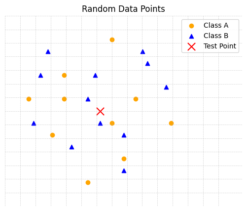
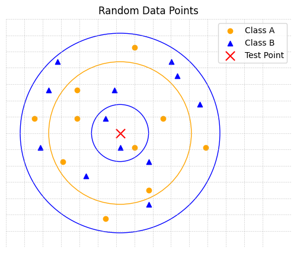

# K-Nearest Neighbors (Classification)
Welcome to $k$-Nearest Neighbours, or KNN for short, one of the most approachable classification algorithms in machine learning. At its core, KNN shows how we can make predictions simply by looking at similar examples in our data, relying on the idea that things which look alike often belong to the same class.

## Intuition
$k$-Nearest Neighbors (KNN) is a supervised learning algorithm used for both classification and regression tasks. KNN works by identifying the $k$ closest neighbors (data points) to a given input and making a prediction based on the majority class (for classification) or the average value (for regression). Here, we’ll focus on classification and begin with a simple real-world example to build some intuition.

*Suppose a new movie has just been released and you are trying to decide whether you should watch it. You have not seen the movie yourself; however, many of your friends have seen it and share similar movie tastes to yours.*

*You ask a few friends for their opinions, and for each friend you also know how similar their tastes are to yours. To make your decision, you decide to only ask friends whose preferences are most similar to yours. Let’s say you consider the opinions of your five most similar friends. If the majority of those friends enjoyed the movie, you would decide the movie is worth watching.*

This is the idea behind $k$-Nearest Neighbors:
- Each friend represents a data point.
- How similar a friend’s taste is to yours corresponds to distance.
- The value of $k$ is the number of friends’ opinions you choose to consider.
- The final decision is made by taking a majority vote among those friends.

It should be noted that if you had chosen a smaller number of friends (for example, $k=3$), your decision would depend on very few opinions and could change easily. Alternatively, if you had chosen a larger number of friends, you would include people whose tastes are less similar to yours, which might influence the decision in a different way.

Additionally, it is generally encouraged to avoid choosing an even value for $k$. When $k$ is even, it is possible for the nearest neighbors to be split evenly between classes, resulting in a tie. In this case, the algorithm has no clear majority to determine the predicted class. Ties are typically resolved by selecting the class of the closest neighbor or by using distance-weighted voting.

$k$-Nearest Neighbors applies this same reasoning to data. Instead of friends and movie preferences, we work with data points and features. Instead of opinions, we work with class labels. To classify a new data point, the algorithm looks at the $k$ most similar points in the dataset and lets them decide the outcome.

## Formal Definition

## Implementing a KNN Classifier with Scikit-Learn

## Implementing a KNN Classifier from First Principles

## Theory Problems
!!! question "Theory Question 1"

    Determine what the test point would be labelled as for $k = 3$, $k = 11$ and $k = 22$.
    
    

??? note "Solution"

    

    Starting with $k = 3$, represented by the inner blue circle, of our three nearest neighbors, 2 are blue triangles and 1 is the organge circle. Therefore, by a majority vote, the prediction for our test point would be  a blue triangle.

    !!! warning "Note"

        You may have noticed that for $k = 22$, we are using an even number. Ideally, we would use an odd number to avoid the possibilty of equal votes (i.e. 11 orange circles vs. 11 blue triangles). However, in this instance, we have 10 orange circles and 12 blue triangles, resulting in a blue prediction. When using KNN, it is important to ensure that a given class (in this case blue triangles) does not out number the majority of the data.

!!! question "Theory Question 2"

    In $K$-Nearest Neighbours, what does $K$ represent?

??? note "Solution"

    Number of neighbours

!!! question "Theory Question 3"

    In $K$-Nearest Neighbours, what does $K$ represent?

??? note "Solution 4"

    Number of neighbours

!!! question "Theory Question 4"

    In $K$-Nearest Neighbours, what does $K$ represent?

??? note "Solution"

    Number of neighbours

!!! question "Theory Question 5"

    In $K$-Nearest Neighbours, what does $K$ represent?

??? note "Solution"

    Number of neighbours

## Practical Problems

## Concluding Notes and Further Resources
